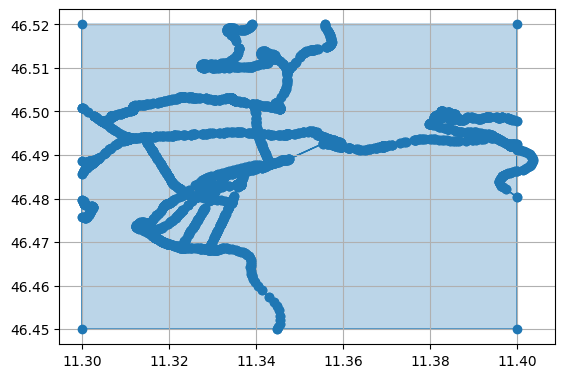

## Paper - UrbanKG

This section reproduces some of the changes from UrbanKG and applies 
them to the South Tyrol dataset. In particular it focuses on the site
selection problem.

### Input data generation
The area chosen for the analysis is Bolzano, South Tyrol. 

#### Filter OSM area
- Download the OSM file from GeoFabrik, North-East Italy
- Use osmium-tool to filter an area around Bolzano (May 11 2024)
```osmium extract -b 11.3, 46.45, 11.4, 46.52 nord-est-latest.osm.pbf -o bolzano.osm.pbf```
- Use Python to get the roads and construct grid 

#### Create classes of brands
- Supermarkets
- FastFood
- ???